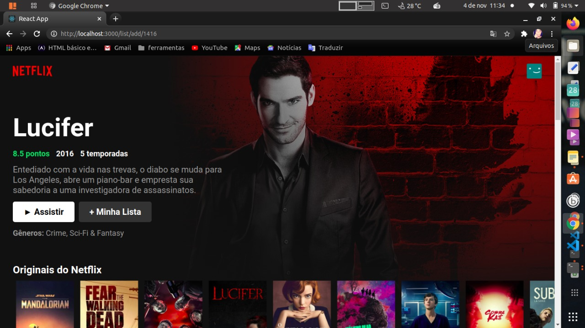
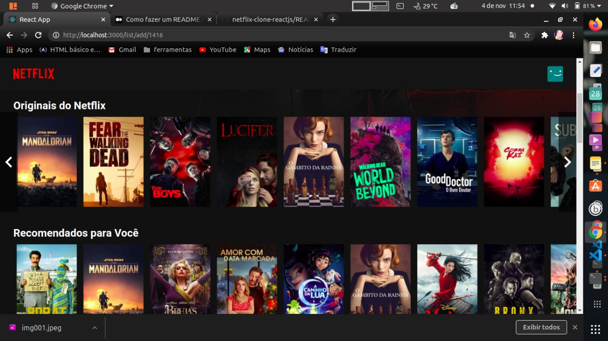

# Clonar a interface Netflix para estudos React.js

Projeto desenvolvido usando React.js. Esse projeto consiste em um clone da página principal da Netflix. Os dados foram obtidos através da API do site The Movie Database.

 

 

 Para obter os dados dos filmes/séries é necessário adicionar a <b>API_KEY </b>que se encontra em ./src/Tmdb.js.

 Obtenha sua <b>API_KEY</b>:

 - [tmbd](https://www.themoviedb.org/)

Depedências [material-ui](https://material-ui.com/components/material-icons/)

    yarn add @material-ui/icons 
    yarn add @material-ui/core  

## Créditos

- [Netflix](https://www.netflix.com/br/)

## Desenvolvido 
- devMarilia  
  [Linkedin](https://www.linkedin.com/in/mar%C3%ADlia-lemos-b2565316a/) 
  [github](https://github.com/devMarilia)
